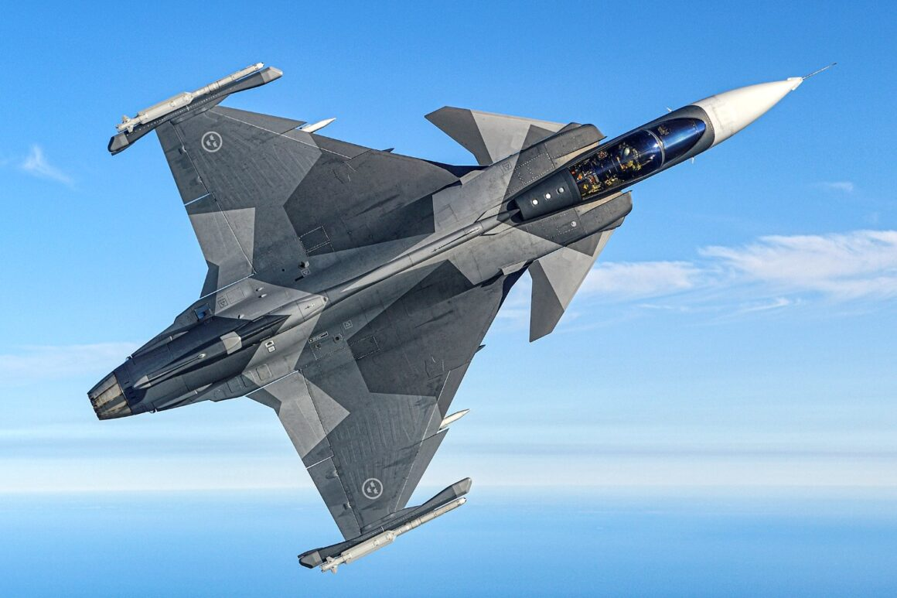
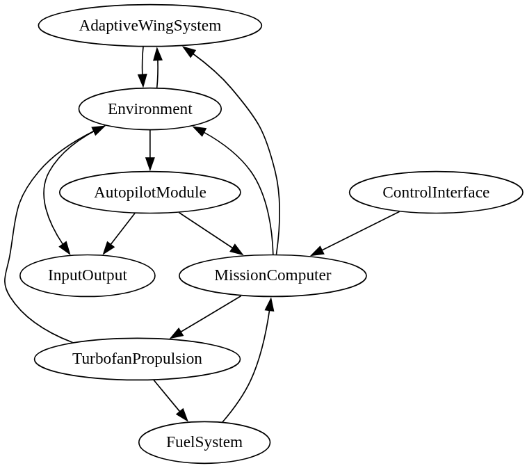

# SSP Simulation platform
Erik Rosenlund
Linköping University, Saab Aeronautics

---

## Overview
- Digital thread from Architecture, Models, Simulation and requirement fulfillment
- Compatible with complex CPS development
- Targets ssp4sim workflows for mission validation
  - Utilizing open model standards such as FMUs, and SSP
- Automated toolchain wraps artifact generation, verification, and simulation steps

---

## Goals

- Create a simple mockup system for complex CPS development, 
  - Single-seat multirole fighter reference project
- SysML v2 packages as definition for system architecture
  - Sub-systems, interfaces, connections, requirements
- Create a workflow that would enable CI/CD

---

## Model developments Workflow

- Model interfaces generated from the architecture
- Package every subsystem as a ready-to-deploy FMU 
- Utilize parameter sets for simulation customization.
- Package sub-systems and parameter sets as a deterministic SSP bundles for simulation.

---

## Architecture Highlights

- SysML requirements cover performance, fuel, control, mission, and propulsion
- Airframe with cropped-delta wing, F100/F110-derived propulsion, HOTAS cockpit
- Mission computer exports flight control, and telemetry taps
- Autopilot, power distribution, and telemetry sink components close the loop

---

## Mission Use Cases

| Use case | Scenario file | Linked requirements |
| --- | --- | --- |
| High-altitude intercept | `resources/scenarios/high_altitude_intercept.json` | REQ_Performance, REQ_Control |
| Deep strike penetration | `resources/scenarios/deep_strike_penetration.json` | REQ_Performance, REQ_Fuel, REQ_Mission |
| CAS multi-store support | `resources/scenarios/cas_multi_store_support.json` | REQ_Control, REQ_Mission |

Each scenario enforces requirement coverage and enables reproducible CI validation.

---

## Results & Next Steps

- OMS runs emit metrics (Mach, g-load, thrust, fuel reserve, stores, autopilot limits) plus waypoint adherence data
- Use `--reuse-results` for post-processing without rerunning OMSimulator
- Extend the SysML architecture or add FMUs → regenerate SSD/SSP with the scripts
- Add new scenarios + requirement mappings to grow coverage

---